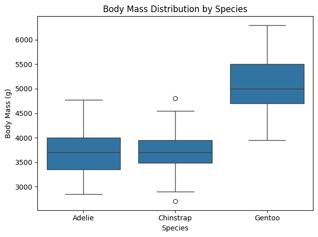

# Palmer Penguins Data Analysis

This project explores the Palmer Penguins dataset using exploratory data analysis (EDA) and visualization techniques to uncover patterns in species characteristics.

## Objective

Analyze relationships between penguin features such as body mass, flipper length, and bill dimensions.

## Tools Used

- Python
- Pandas
- Seaborn
- Matplotlib
- Jupyter Notebook

## Visualizations

### Correlation Heatmap

### Body Mass Distribution

## Key Insights

- Strong correlations exist between body mass and flipper length  
- Different species show distinct physical characteristics  
- Body mass varies significantly across species  

## Project Files

- `penguins_analysis.ipynb` – main notebook  
- `penguins-chart-1.png` – correlation heatmap  
- `penguins-chart-2.png` – body mass distribution  
